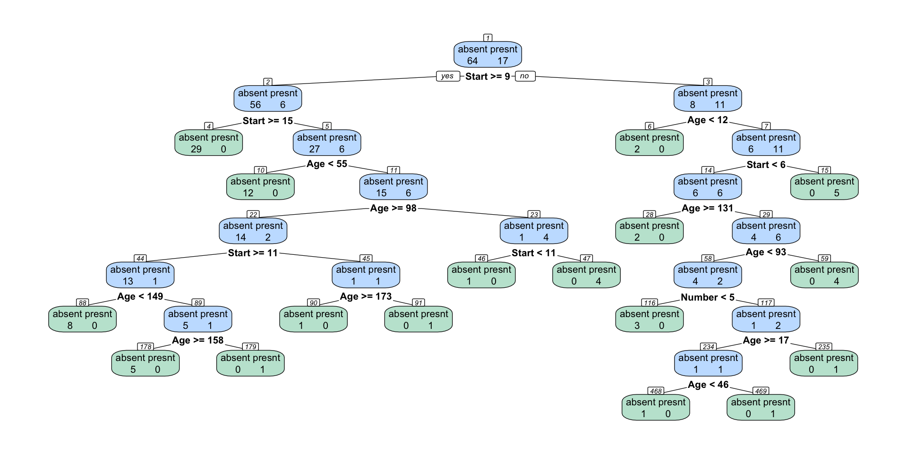

<!-- README.md is generated from README.Rmd. Please edit that file -->

# annotreer

<!-- badges: start -->

<!-- badges: end -->

The goal of annotreer is to provide a wrapper to `rpart.plot::prp()` to
make it easier to label decision tree plots with complexity parameter
calculations. These annotations are helpful for explaining CART’s
pruning algorithm.

## Installation

You can install the development version of annotreer from
[GitHub](https://github.com/) with:

``` r
# install.packages("pak")
pak::pak("jtr13/annotreer")
```

## Example

``` r
library(annotreer)
library(rpart)
kmod <- rpart(Kyphosis ~ Age + Number + Start, data = kyphosis, cp = 0, minsplit = 2)
annotree(kmod)
```


